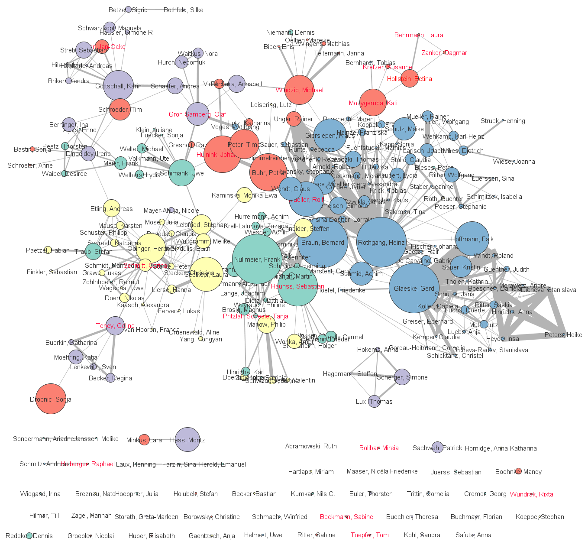
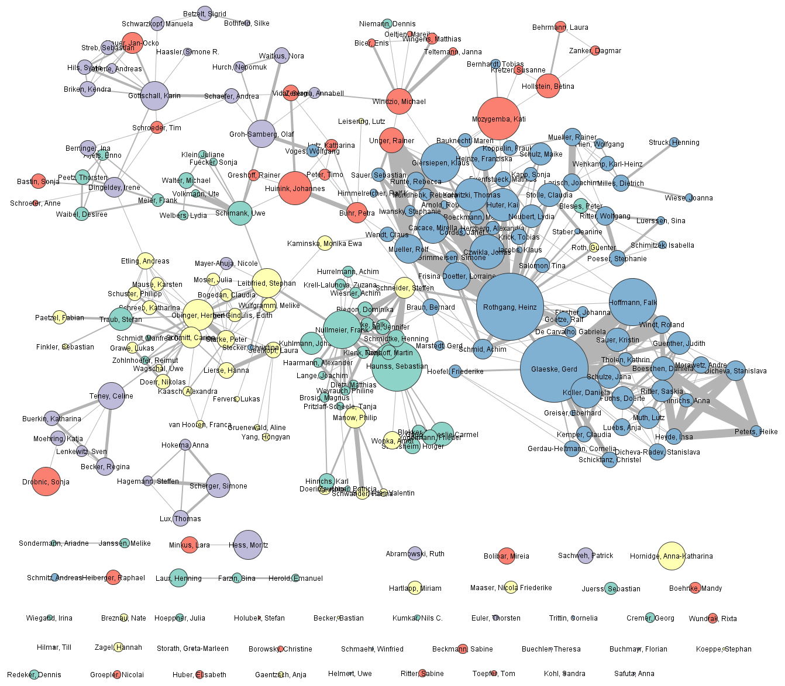

```{r setup, include=FALSE}

knitr::opts_chunk$set(echo = FALSE,
                      fig.align = "center",
                      dev = "pdf",
                      cache = FALSE,
                      fig.path = "figs/")

library(here)
library(dplyr)
library(tinytex)
library(knitr)
library(kableExtra)
library(stargazer)

```

```{r data, incude=FALSE}

load("macro_des.RData")
load("micro_des_soc.RData")
load("reg_results.RData")
load("top20_df.RData")

```

\newpage
\tableofcontents
\newpage

# Introduction {.unnumbered}  

Collaboration practices in science have been a center of attention for a long time: operationalizations, causes, effects and implications have been studied from various angles within and across disciplines [see e.g. @beaver_reflections_2001 or @henriksen_research_2018 for overviews]. The most popular operationalization of collaboration is unarguably co-authorship, as it constitutes an easily quantifiable and, nonetheless, central characteristic of scientific work. However, that co-authorship is maybe the most visible but not the only meaningful form of collaboration in science [@katz_what_1997] is widely acknowledged. Over the course of the last century the amount of co-authored scientific literature has steadily increased in nearly every discipline, and more rapidly so for the past twenty years [@henriksen_rise_2016]. This trend has also been apparent in the social sciences where co-authorship has traditionally been much less prominent than in the physical and life sciences [e.g. @wallace_small_2012; @wuchty_increasing_2007]. Important reasons for this development are believed to be found in the necessity of labor division due to increased specialization [@fisher_how_1998; @laband_intellectual_2000] and the growing competitive pressure on scientists that leads them to produce more research output [@hangel_why_2017], both of which is enhanced by the simplification of communication via new technologies. Several studies provide evidence that links research collaboration to scientific productivity and performance [@abbasi_identifying_2011; @bordons_relationship_2015; @hu_how_2014]. Against this backdrop, it becomes more attractive for governments and public institutions to foster the establishment of research centers, bringing together scientists from different disciplines or universities, or from within those. One approach to analyze the features and patterns of research collaboration lies in the methods of network analysis, as they allow to study individual as well as overall characteristics of interdependent data structures. Most prominently, co-authorship and citation networks have served as a way to investigate this collaborative behavior and the structures underlying research practices within and across disciplines [e.g. @abbasi_identifying_2011; @jansen_knowledge_2010; @newman_structure_2001].  

In this paper I am looking at the case of the SOCIUM research center at the University of Bremen, an internal research facility that comprises a large share of the university’s social scientists. I construct a co-authorship network for the members based on publications from 2010 until March 2020. Descriptive characteristics of the overall network structure, as well as of its individual members, are laid out. I discuss the findings in the light of past research on scientific co-authorship networks, addressing general implications and those specific for the facility. I formulate several hypotheses to investigate some of the facility’s specific characteristics.  

I proceed as follows: a first chapter looks at the meaning and development of research collaboration in a more general sense. After that, I elaborate on co-authorship practices in the social sciences specifically, before laying out the approach of network analysis. In chapter four I describe the SOCIUM research center, before stating my hypotheses in chapter five. Next follows a description of the data and methods I used and then the display of my results. The last two chapters are a discussion of the results followed by the conclusion I draw from this study.  

# The Role of Research Collaboration  

Before looking at contributing factors and effects of research collaboration, one must clarify what research collaboration actually means. A broad approach would consider even, e.g., a helpful remark at a conference as part of the process, and advancing research would be an endeavor of the entire global scientific community [@subramanyam_bibliometric_1983]. A narrower stance has been taken by @laband_intellectual_2000 who analyze formal (co-authorship) as well as informal (consultation of colleagues, acknowledgements in publications) indicators of collaboration. In scientometric studies co-authorship or citation practices are used as proxies for collaboration, often applied in a network analytic framework. Another distinction that has to be made is whether to look at inter- or intradisciplinary research. Even though collaboration has generally increased for both types, there exist noteworthy particularities for the specific disciplines [@van_rijnsoever_factors_2011].  

When looking at possible motives for collaborative research we encounter discipline specific as well as more general phenomena. The collaborative behavior in the physical and life sciences can be tied to the more resource intensive – in terms of laboratories, specialized knowledge, technical supply and the respective funding – way of conducting research [@cronin_hyperauthorship_2001; @wuchty_increasing_2007]. In analogy, part of the increase in collaboration in the social sciences can be attributed to the increased need of knowledge resources in the form of experts for quantitative methods and statistics [@fisher_how_1998; @laband_intellectual_2000]. A general development in scientific practice has been the growing importance of publication for career advancement, especially for young researchers [@hangel_why_2017]. This tendency is supported by the establishment of performance measures like impact factors or citation indices which are taken into account for the evaluation of researchers [@ingwersen_influence_2014; @ossenblok_representation_2012]. Nonetheless, personal and epistemic reasons are still important motivations that foster scientific publication [@hangel_why_2017]. Another fact that should be considered when looking at the increase of co-authorships is the mere accretion of total researchers in the past century and the grown promotion of scientific practice [@claxton_scientific_2005].  

Finally, the question arises what impact collaboration actually has on research. @fanelli_researchers_2016 find that researchers publication output has increased over the past century, but so has the practice of co-authorship. Arguing for a fractional weighting of papers accordingly, they do not find any increase in productivity from 1900 until 2013. However, and maybe more importantly, collaboration seems to be highly beneficial for researchers in terms of research impact and career advancement [@li_co-authorship_2013; @lutter_who_2016; @wuchty_increasing_2007].  

# Collaboration Practices in the Social Sciences  

Compared to other areas of research the social sciences show a less collaborative behavior when looking at statistics of co-authorship. Nonetheless, the share of co-authored articles has risen, most notably since the 1980s, and by now about a third to a half of peer reviewed articles are co-authored, depending on the sub-discipline [@fisher_how_1998; @henriksen_rise_2016; @hunter_collaborative_2008]. The general pattern that becomes apparent when looking at the different disciplines of social science is that co-authorship becomes less prominent the more similar a field is to the humanities and arts [@henriksen_rise_2016].    

Does that mean the social sciences themselves are actually anti-social? By comparing citation behavior in biology and economics  @laband_intellectual_2000 show that while there is more formal co-authorship in biology than in economics, informal collaboration is much more pronounced in economics: the number of colleagues, reviewers and editors thanked in articles as well as workshops or seminars attended exceeds those in biology by far. This hints at the fundamentally different organizational logics of the disciplines.  

@whitley_intellectual_2006 [cited in @henriksen_research_2018 30-32) developed a two-dimensional theoretical framework to capture the organization of sciences: the dimension of mutual dependency entails the degree to which conducting research is dependent on colleagues, whereas task uncertainty covers in how far researchers of the discipline agree on appropriate methods and goals that should be achieved through their research. Political science, for example, is a discipline with low mutual dependency as it comprises various subfields with their respective audiences; this is also reflected by the, on average, low number of authors per article. The task uncertainty, on the other hand, is rather high due to the different aims of the subfields and the fact that results are often open for interpretation. Conversely, according to this definition, in a natural science like biology researchers are much more mutually dependent and less uncertain in their tasks.  

An important caveat that has to be mentioned when comparing the social sciences to other fields of research are the differing publication cultures: apart from journal articles books, national and non-scholarly publications make up an important part of publishing in the social sciences [@hicks_four_2005]. However, when analyzing co-authorship or citation behavior, this research is most often based on bibliometric data that is included by the Social Science Citation Index. The SSCI, however, does not cover most publications of the aforementioned types. Hence, when looking at bibliometric analyses based on indexed articles one should keep in mind that those do not show the full picture of publishing in the social sciences.  

# Studying Research Collaboration Through Network Analysis  

Network analysis has become a relevant approach across a variety of disciplines, and the metaphorical character of the term [@hennig_studying_2012 14] allows for an intuitive access to the concept. Examples of network structures can be found basically everywhere around us, and thus are present in many areas of research:  

> 'Frequently mentioned examples of “everywhere networks” include the Internet and other infrastructure networks, social, political and economic networks, scientometric and text-representational networks, as well as food webs and molecular-level biological networks. And there is a host of other, less commonly mentioned networks in many more research areas.'  
[@brandes_what_2013 2]  

In scientometrics and science studies, more generally, these networks can be constructed from bibliometric data, which results in networks connecting authors to publications or each to one another. Network measures can illuminate to what extent and under which circumstances those links (edges, ties) appear, both on the micro-level of individual nodes (vertices) and the macro-level of the overall network.  

An important measure is the degree centrality of a node. It is the number of other nodes connected to a given node. Looking at co-authorship networks, studies find that high degree centrality is linked to better research performance measures [@abbasi_identifying_2011; @bordons_relationship_2015] and higher productivity [@hu_how_2014]. High eigenvector centrality on the other hand, a measure that rises if a node is connected to many other well-connected nodes, is found to be negatively correlated to performance in the same studies. This can be explained by considering that it is rather unlikely for all co-authors of a well-connected author to be well-connected as well [@bordons_relationship_2015 143]. Betweenness centrality of a node can be interpreted as its bridging role within a network, as it describes the number of shortest paths going through a node. Regarding performance measures there have been mixed results for betweenness [@abbasi_identifying_2011; @jansen_knowledge_2010; @li_co-authorship_2013], however, it seems to foster network growth over time, as new authors prefer to connect to authors with high betweenness centrality [@abbasi_betweenness_2012]. Also, the strength with which an author is connected to its co-authors seems to play an important role. For two authors it is simply the number of mutual publications or, in network terms, the weight of their ties. High average tie strength has been linked to higher performance measures [@abbasi_identifying_2011; @bordons_relationship_2015].  

Changing the perspective from the single author to the whole network introduces more insightful indicators. We can calculate macro-descriptive centralization measures for the respective kinds of centrality. They display how (un)evenly distributed a measure is over the network, e.g., there can be few central nodes in a network (high centralization), or nodes across the network do not differ much regarding centrality (low centralization). @bordons_relationship_2015 found low centralization for networks of authors from statistics, nanoscience and pharmacology. Another aspect that can be observed, is whether all nodes can be reached from any other node or, if this is not the case, into how many components the network is split up. As the size of the network grows, it gets more likely that all nodes will be part of a giant component [@newman_structure_2001].   

# The SOCIUM Research Center  

In order to assess the circumstances under which the results of this study apply and in how far they might be generalizable, I want to lay out the characteristics of the case that is under investigation here. The SOCIUM Research Center on Inequality and Social Policy (henceforth referred to as SOCIUM)  

> 'is the only German research institute in social sciences which deals with theoretical and empirical questions of inequality, social policies and their social and political interdependencies. The interdisciplinary research focuses on the social, economic, political, cultural, organizational, legal, historical and sociomedical conditions and effects of social inequality, public social policies and their interdependencies.'  
[@universitat_bremen_welcome_2020]  

It currently has 136 members, most of which have a background in sociology or political science, but also scientists from related disciplines are present, who together approach the abovementioned topics from within six thematic departments:  

1. Theoretical and Normative Foundations
2. Political Economy of the Welfare State
3. Dynamics of Inequality in Welfare Societies
4. Life Course, Life Course Policy, and Social Integration
5. Health, Long-Term Care and Pensions
6. Methods Research  

Especially the health department differs disciplinarily, having members with a background in pharmacology, epidemiology, public health and administration (additional to sociology and political science). All the departments have several working groups that take a narrower thematic approach. Within these working groups researchers work on specific projects that are mostly publicly funded, but also through private sector organizations.  

The SOCIUM is not a private research institute, but belongs to the University of Bremen, a medium-sized public university in Germany. Hence, many of the researchers are also involved in teaching, especially the senior ones. Apart from research and teaching, also conferences and workshops are held at the center.  
The SOCIUM is not the only social scientific research institute at the University of Bremen. In the same building also the Research Centre for International Relations, European Politics, and Political Theory (InIIS) has its offices, and both institutions are part of the Collaborative Research Centre 1342 "Global Dynamics of Social Policy" (CRC), together with institutions from four other German universities. Some members of the CRC that are not part of the SOCIUM or InIIS are located in the mentioned building as well. Additionally, the Bremen International Graduate School of Social Sciences (BIGSSS) is a cooperating partner of the SOCIUM, and a part of the graduate students’ offices are also in that same building. Naturally, members collaborate across those institutions, and an analysis covering all institutions might paint an even more realistic picture.  

# Hypotheses  

Even though, since we are looking at a rather specific case, the nature of this paper is more explorative, I formulate two sets of hypotheses about the SOCIUM’s co-authorship structure. The first looks at overall characteristics of the co-authorship network, the second at the individual authors.    
\newline
\setlength{\parindent}{0em} 
*Macro Hypotheses*  
I expect the overall collaboration structure to be balanced, meaning, collaboration does not revolve around a few central actors, but most members are more or less equally collaborative. This behavior should be fostered by the thematic proximity of researchers within departments, the manageable size of the research center and the existing spatial proximity, all together lowering boundaries for collaboration. I argue that this balance would become manifest in low centralization measures and a majority of the members being part of one component.  

> **H1**: The network shows low centralization and a high percentage of membership in one component.  

The organizational structure with six departments of different topical foci suggests that members of a respective department have fairly common research interests, which should promote collaborative research behavior. Hence, I argue that homophily (assortativity) across the network should be rather high if we regard department affiliation as the assorting mechanism. The idea behind homophily is that people who are more similar to one another are more likely to form ties, which has proven a robust concept in the social sciences [@mcpherson_birds_2001].  

> **H2**: The network is highly homophilous with regard to department collaboration.  

*Micro Hypotheses*  
The health department differs an important aspect from the other departments: the disciplinary background of its members is more diverse and instead of political scientists or sociologists it has more public policy researchers and life scientists. For these research areas studies have shown a higher degree of co-authorship than for the core social sciences [@henriksen_rise_2016].  

> **H3**: Membership in the health department is positively associated with degree centrality.  

When looking at the methods department, it can be observed that none of the members is solely a member of this department, but also of another, more “content-oriented” department. It is described on the SOCIUM-website as “a platform for the interdisciplinary exchange of all SOCIUM-researchers on advanced methods of empirical social research” [@universitat_bremen_methods_2020]. The members of the department have above-average expertise in different qualitative and quantitative methods which are applicable in various contexts. Therefore, I argue that they could function as bridging points between the departments. 

> **H4**: Membership in the methods department is positively associated with betweenness centrality.   

In the next chapter I present the data and chosen methods to explore the SOCIUM’s co-authorship network and its hypothesized characteristics.  

# Data and Methods  

*Data*  
The co-authorship network has been constructed from the publication bibliographies that are available on the SOCIUM’s website^[socium.uni-bremen.de/veroeffentlichungen/]. They comprise monographs, edited volumes, journal articles, articles in edited volumes, working and discussion papers, and also grey literature, which makes this study more representative of the publication behavior in the social sciences [@hicks_four_2005]. In total, this results in 2278 publications by 1239 authors, 240 of which are or have been members or affiliated members of the institute (as listed on the website). I collected the data for a time span of ten years (2010 until March 2020) to arrive at a reasonably sized data set.  
\newline
\setlength{\parindent}{4em}
*Methods*  
To investigate the macro hypotheses, I rely on the measures of the assortativity coefficient (H1), the degree, betweenness and eigenvector centralization, and the percentage of members in the largest component (H2). I use the assortativity coefficient for discrete characteristics (department membership in this case) proposed by @newman_mixing_2003, which takes the value 0 when there is no assortative mixing and 1 when there is complete assortativity. The centralization measures are calculated as the “variation in the [respective values] of vertices divided by the maximum […] which is possible in the network of the same size” [@bordons_relationship_2015 138, referring to @wasserman_social_1994]. Components are parts of the network that are not connected to the remaining network; they can consist of multiple or single nodes (isolates).  

For the micro hypothesis H3 I make use of inferential statistics in the form of a linear regression model. As the dependent variable, degree centrality, follows a log-normal distribution, I take the natural logarithms of its values to employ them on the linear model. Department membership is the categorical independent variable, and I will test whether being part of the health department differs significantly positive from the other departments with regard to degree centrality. To account for robustness of the estimates I exclude the cases of Gerd Gläske and Heinz Rothgang (heads of the health department), whose values for degree centrality are about twice as large as for the next largest observation. Isolates are excluded, as well.  

As for H4, I will again resort to descriptive methods, since the distribution of the data for betweenness centrality does not allow for any valid statistical modeling approach. I present a graph of the network to investigate betweenness centrality of the SOCIUM members visually, instead.^[All calculations have been carried out in R (version 3.6.2). For network measures the package “igraph” has been used. Visualization has been done in visone (version 2.18).]  

# Results  

*Macro Characteristics*  
Table 1 lists the characteristics of the overall network. The complete network, that is, authors not affiliated with the SOCIUM included, consist of 1239 researchers, having produced 2278 publications. With a number of 4396 edges, exceeding the number of nodes by far, the network is rather dense. On average, the authors published 4.18 pieces of literature in those ten years with about 2.27 authors per publication, which is in line with prior studies about co-authorship in the social sciences [e.g. @henriksen_rise_2016]. There is little degree centralization (13%), notable betweenness centralization (31%) and almost complete eigenvector centralization (98%). This implicates that there are very few highly central authors that are also connected to other central authors (eigenvector), but none who accrue the majority of edges (degree) or the majority of shortest paths (betweenness). Even though the network consists of a substantial number of components (26, excluding isolates), the vast majority of authors (87.2%) is part of the largest component. These findings lend partial support for H1: even though, overall, authors seem to be connected equally well, we find some highly central nodes that are mostly connected to other well-connected nodes, and not to, e.g., graduate students and junior researchers who have not had the chance to collaborate much.

Excluding the authors that are not SOCIUM members results in 240 nodes that are connected by 461 edges. Looking at the assortativity coefficient (0.75), we find clear evidence for the authors preferably working together within their departments (H2). Still, there seems to be room for collaboration across departments, as well.  
```{r macro_des}

kable(macro_des, format = "latex", booktabs = TRUE, col.names = NULL,
      caption = "Overall network charactersitics.") %>%
  kable_styling(font_size = 10) %>%
  pack_rows("Complete Network", 1, 11) %>%
  pack_rows("SOCIUM", 12, 14)
  

```
\setlength{\parindent}{0em} 
*Micro Characteristics*  
\setlength{\parindent}{4em}
Most of the SOCIUM’s members are part of the health department, the fewest are found in the methods department. The numbers do not add up to 240 because multiple membership is possible (mostly second membership is in the methods department). These and other author characteristics can be found in Table 2^[Closeness centrality was omitted because of the network not being completely connected.].  
```{r micro_des, results='asis'}

stargazer(df.vert_red[c("dep1", "dep2", "dep3", "dep4", "dep5", "dep6", "dep_cat2", "tot_pub", "degree", "betweenness", "eigenvector", "strength")], 
          title = "Summary statistics of author characteristics", digits = 1, font.size = "footnotesize", type = "latex", header = FALSE)

```
Table 3 displays the results for the linear regression of degree centrality on department membership. The department for normative and theoretical foundations serves as reference category, and we can see that only for the health department degree centrality is significantly increased. Figure 1 shows the predicted values for all departments. We can see here that the health department really only differs significantly from the reference category, but not from the other departments, which lends partial support for H3. A figure of the network displaying node size according to degree can be found in the appendix (Figure A).
Figure 2 displays the co-authorship network of the SOCIUM’s members. Nodes are sized according to betweenness centrality for the whole network, including external authors. Members of the methods department are marked in red. We can see that node size does not increase in favor of those members but rather with regard to position within a department. The heads of the departments as well as members of the health department show especially large node sizes. This perception is also supported by the ranking table found in the appendix (Table A).  
```{r reg_results, results='asis'}

stargazer(m1, star.cutoffs = c(0.05, 0.01, 0.001), font.size = "footnotesize", 
          type = "latex", header = FALSE,
          covariate.labels = c("Economy", "Inequality", "Life Course", "Health"),
          dep.var.labels = "ln(Degree)", dep.var.caption = "",
          title = "Results of the linear regression of degree centrality on department membership.")

```

```{r plot_between, fig.align = 'center', out.width = "100%"}



```

```{r plot_between_legend, fig.align='left', out.width = "40%", fig.cap = "Co-Authorship Network of the SOCIUM Reflecting Betweenness Centrality. Members of the methods department are marked in red. Ties sized according to weight."}


```


# Discussion  

The case study of the SOCIUM’s co-authorship network revealed some interesting insights into the institution’s collaboration structure. Collaboration seems to be most present within department boundaries, as the assortativity coefficient indicates. However, homophiliy is not so strong that it does not allow for across-department collaboration. This is probably also supported by the manageable size of the center and the spatial proximity of all its members. The centralization measures for degree and betweenness point to an overall quite equally cooperative network, as does the number of members in the largest component. The eigenvector centralization, however, points to a few highly central nodes that are mostly connected to other central nodes. Looking at Table A, they all turn out to be members of the health department. This could be explained by them not being very involved in the training of graduate students. The health department seems to be different from the remaining network in general: its members are among the most central ones according to all measures, and they also publish more, as indicated by the tie sizes in Figure 2. This tendency is most pronounced by the heads of the department’s working groups, Heinz Rothgang and Gerd Gläske, but applies to the remaining department members, as well. These findings are in line with previous work on scientific collaboration that find co-authorship practices to be more established in the life sciences and public health research [@henriksen_rise_2016; @laband_intellectual_2000]. It would also fit studies about the publication practices in the social sciences [@hicks_four_2005]: as books are still a relevant form of publication but take longer to write than articles, the publication output, on average, is lower. However, this assumes that the data are reliable. Maybe members of the health department are more motivated to make their work visible and therefore are more meticulous in making sure their publications are actually listed on the website.  

As for the methods department, there seems to be no special role as bridging actors. However, it is possible that this characteristic manifests in informal collaboration that is not visible in a network constructed from co-authorship. Members of other departments could seek advice from those researchers without accrediting this through formal co-authorship. This would confirm the findings of @laband_intellectual_2000, that informal collaboration is a common practice in the social sciences.  

# Conclusion  

This paper has investigated research collaboration, defined as co-authorship, for the case of the SOCIUM research center. After laying out general characteristics of scientific collaboration and the social sciences in particular, as they are studied in the literature, I gave an overview of contributions from network analytic work. I presented how the SOCIUM research center is organized and what its aims are. Then, I applied some of the presented network measures to the case at hand to find out more about its collaboration structure. As it turns out, co-authorship happens mostly within departments, but also crosses those boundaries. The health department is especially productive and well-connected, as network measures show. The methods department does not take a bridging role, supplying different hubs of researchers with methodological knowledge, at least none that is visible through formal co-authorship. These findings are probably most relevant for the research center itself, but also reflect findings from previous research, most notably about co-authorship practices in different disciplines.  


Future research on this case could take into account additional author characteristics like gender, discipline and methodological approach to shed more light on the determinants of co-authorship. It would also be interesting to include the other mentioned research facilities of the university into the analysis, or look at the external collaborators and maybe single out other institutions and universities that the SOCIUM is well connected to. 

\newpage

# References {.unnumbered}  

\begingroup
\setstretch{1.0}
\setlength{\parindent}{-0.2in}
\setlength{\leftskip}{0.2in}
\setlength{\parskip}{0em}
\indent  
<div id="refs"></div>
\endgroup
\newpage  

# Appendix {.unnumbered}

```{r plot_central, fig.align = 'center', out.width = "100%"}



```

```{r plot_central_legend, fig.align = 'left', out.width = "40%", fig.cap = "Co-Authorship Network of the SOCIUM Reflecting Degree Centrality. Ties sized according to weight."}


```